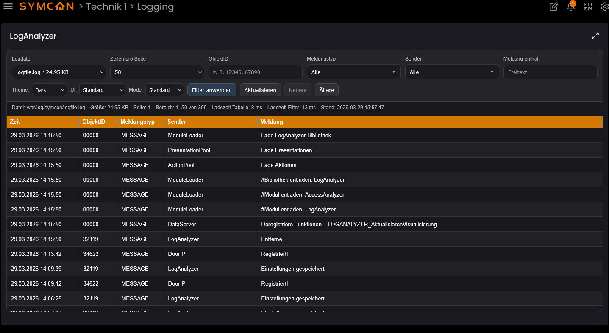
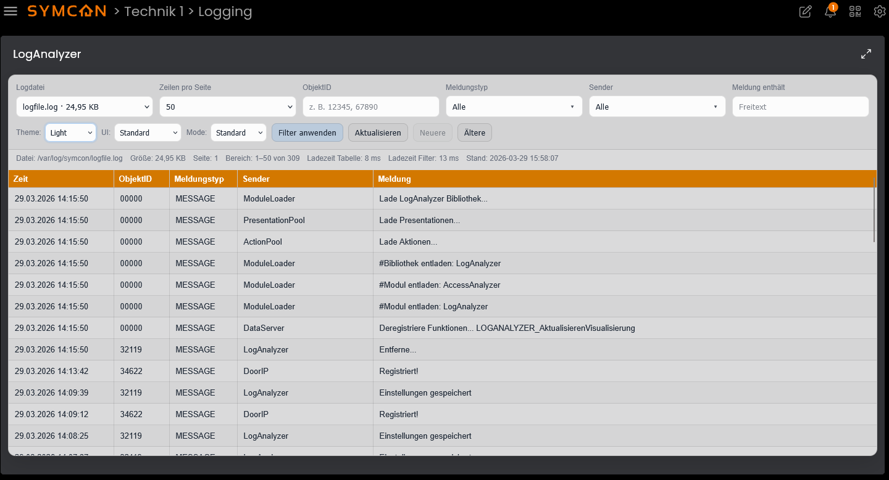

# LogAnalyzer

[](https://www.symcon.de)


Das Modul **LogAnalyzer** ermöglicht die Analyse und Filterung von IP-Symcon Logdateien direkt im WebFront.  
Logeinträge können gefiltert, durchsucht und seitenweise geladen werden. Dabei stehen verschiedene Betriebsmodi zur Verfügung.

> **Hinweis:** Dieses Modul ist ausschließlich für die **neue Kachelansicht (Tile View)** von IP-Symcon entwickelt.  
> Die klassische WebFront-Ansicht wird **nicht unterstützt**.

---

### Inhaltsverzeichnis

1. Funktionsumfang  
2. Voraussetzungen  
3. Software-Installation  
4. Einrichten der Instanzen in Symcon  
5. Statusvariablen und Profile  
6. Visualisierung  
7. PHP-Befehlsreferenz  
8. Screenshots  

---

## 1. Funktionsumfang

- Anzeige von IP-Symcon Logdateien in der Kachelvisualisierung  
- Seitenweise Darstellung großer Logdateien  
- Filterung nach:
  - Objekt-ID
  - Meldungstyp
  - Sender
  - Freitext (Meldung)  
- Dynamische Filterlisten basierend auf Logdaten  
- Navigation durch Logseiten (ältere / neuere Einträge)  
- Anzeige von Trefferbereich und Gesamtmenge  
- Lade- und Statusindikator während der Verarbeitung  
- Umschaltbares Theme (Dark / Light)  
- Umschaltbarer kompakter Darstellungsmodus  
- Auswahl verschiedener Betriebsmodi zur Performance-Optimierung  
- Auswahl der Logdatei direkt in der Tile  
- CSV-Export im Ultra-Modus  
- Temporäre Downloadlinks für CSV-Exporte  
- Automatische Bereinigung abgelaufener Exportdateien  

### Betriebsmodi

Das Modul stellt drei Betriebsmodi zur Verfügung:

**Standard**
- Reine PHP-Verarbeitung  
- Maximale Kompatibilität  
- Geeignet für kleinere Logdateien  

**System**
- Nutzung von Systemwerkzeugen (z. B. grep, awk, PowerShell)  
- Höhere Performance bei großen Logdateien  

**Ultra**
- Nutzung eines externen Ultra CLI Tools  
- Höchste Performance  
- Unterstützt:
  - schnelle Seitenabfragen
  - Trefferzählung
  - Filtermetadaten
  - CSV-Export
- Erfordert ein installiertes Ultra CLI Tool  

---

## CSV-Export (Ultra-Modus)

Im Ultra-Modus stehen Exportfunktionen zur Verfügung:

- Gesamtes Filterergebnis exportieren
- Aktuellen Seitenbereich exportieren

Eigenschaften:

- Export erfolgt über Ultra CLI
- Datei wird temporär gespeichert
- Download erfolgt über signierten Token-Link
- Mehrere Exporte gleichzeitig möglich
- Automatische TTL-basierte Bereinigung

---

## Sicherheit (Download-Hook)

Der CSV-Download erfolgt über einen internen WebHook:

```
/hook/loganalyzer/<InstanceID>/download?token=<token>
```

Sicherheitsmechanismen:

- Zufälliger Token pro Export
- Token-Formatprüfung
- Serverseitige Token-Validierung
- Kein Zugriff auf beliebige Dateien möglich
- Keine Ausführung von Befehlen über URL
- Zugriff nur auf intern registrierte Exportdateien
- Automatische TTL-basierte Löschung
- Kein Directory Traversal möglich

Der Hook ist somit auch bei aktivem Connect-Dienst sicher nutzbar.

---

## Unterstützte Betriebssysteme

Getestete Systeme:

- Linux Debian 13
- Windows 11
- Docker (Debian basierend)

Weitere Systeme sollten grundsätzlich funktionieren, sind jedoch nicht getestet:

- macOS
- NAS-Systeme
- andere Linux Distributionen

---

## 2. Voraussetzungen

- IP-Symcon ab Version **8.1** empfohlen  
- Zugriff auf eine gültige Logdatei  
- Ultra CLI Tool (nur für Ultra-Modus erforderlich)  

---

## 3. Software-Installation

- Über den Module Store das Modul **LogAnalyzer** installieren  
- Alternativ über das Module Control eine entsprechende Repository-URL hinzufügen  

---

## 4. Einrichten der Instanzen in Symcon

Unter **„Instanz hinzufügen“** kann das Modul *LogAnalyzer* über den Schnellfilter gefunden und hinzugefügt werden.  

Weitere Informationen:  
https://www.symcon.de/service/dokumentation/konzepte/instanzen/#Instanz_hinzufügen  

---

### __Konfigurationsseite__:

Die meisten Einstellungen erfolgen direkt in der Tile-Visualisierung.  
Für den Ultra-Modus muss zusätzlich der Pfad zur Ultra CLI im Backend hinterlegt werden.

---

## 5. Statusvariablen und Profile

Dieses Modul legt **keine eigenen Statusvariablen oder Profile** an.  

Die gesamte Darstellung erfolgt direkt über die Visualisierung.

---

## 6. Visualisierung

Die Visualisierung stellt eine interaktive Oberfläche zur Analyse der Logdaten bereit.

### Funktionen

**Filterbereich**
- Logdatei-Auswahl  
- Zeilen pro Seite  
- Objekt-ID Filter  
- Meldungstyp (Multi-Select)  
- Sender (Multi-Select)  
- Freitextsuche  

**Bedienelemente**
- Filter anwenden  
- Aktualisieren  
- Navigation zu älteren / neueren Einträgen  
- Theme-Auswahl (Dark / Light)  
- Kompaktmodus  
- Auswahl des Betriebsmodus (Standard / System / Ultra)  
- CSV Export (Ultra)  

**Statusanzeige**
- Aktuelle Datei  
- Dateigröße  
- Trefferbereich  
- Gesamtanzahl Treffer  
- Ladezeit Tabelle  
- Ladezeit Filter  
- Zeitstempel der Daten  

**Tabelle**
- Zeitstempel  
- Objekt-ID  
- Meldungstyp  
- Sender  
- Meldung  

---

## 7. PHP-Befehlsreferenz

Dieses Modul stellt **keine öffentlichen PHP-Funktionen** zur direkten Verwendung bereit.  

Die Kommunikation erfolgt ausschließlich über die interne Visualisierung (`RequestAction`).

---

## 8. Screenshots

### WebFront Ansicht

Ansicht im Webfront der neuen Kacheloberfläche - hier DarkMode:



Ansicht im Webfront der neuen Kacheloberfläche - hier LightMode:



---

### Konfigurationsformular (Backend)

Ansicht im Konfigurationsformular des Moduls:


---

## Hinweise

- Große Logdateien werden seitenweise geladen  
- Ultra-Modus benötigt externes CLI Tool  
- CSV-Export nur im Ultra-Modus verfügbar  
- Exportdateien werden automatisch gelöscht  
- Verhalten kann je nach Plattform variieren  
