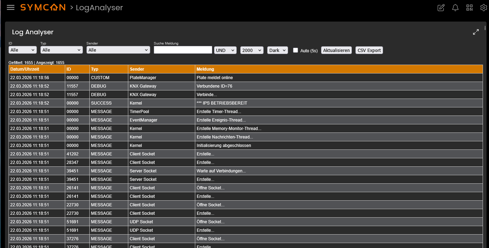
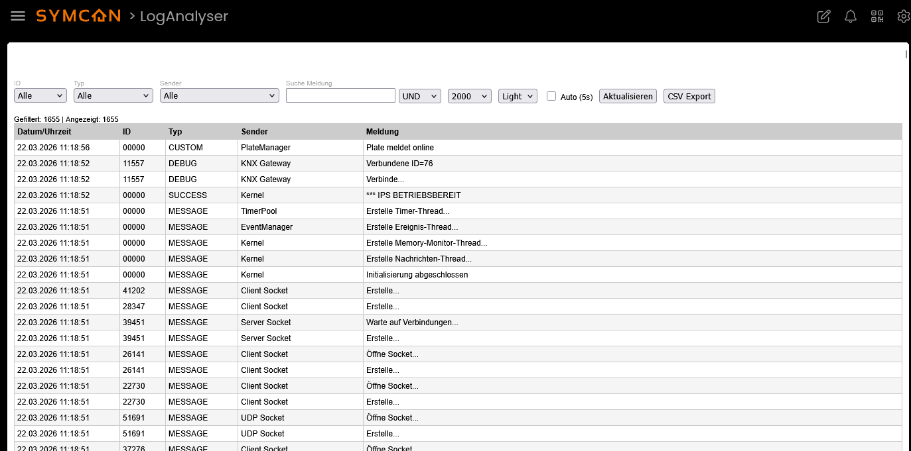
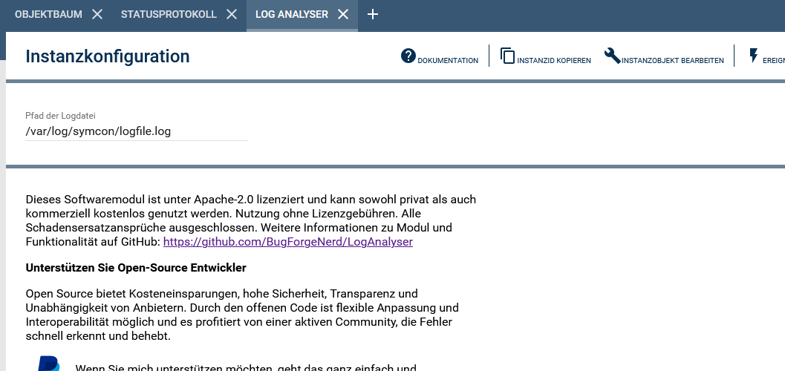

# LogAnalyzer

Das Modul **LogAnalyzer** ermöglicht die Analyse und Filterung von IP-Symcon Logdateien direkt im WebFront.  
Logeinträge können nach verschiedenen Kriterien gefiltert, durchsucht und als CSV exportiert werden.

> **Hinweis:** Dieses Modul ist ausschließlich für die **neue Kachelansicht (Tile View)** von IP-Symcon entwickelt.  
> Die klassische WebFront-Ansicht wird **nicht unterstützt**.

---

### Inhaltsverzeichnis

1. [Funktionsumfang](#1-funktionsumfang)  
2. [Voraussetzungen](#2-voraussetzungen)  
3. [Software-Installation](#3-software-installation)  
4. [Einrichten der Instanzen in Symcon](#4-einrichten-der-instanzen-in-symcon)  
5. [Statusvariablen und Profile](#5-statusvariablen-und-profile)  
6. [Visualisierung](#6-visualisierung)  
7. [PHP-Befehlsreferenz](#7-php-befehlsreferenz)  
8. [Screenshots](#8-screenshots)  

---

## 1. Funktionsumfang

- Anzeige von IP-Symcon Logdateien im WebFront  
- Filterung nach:
  - Textinhalt (Meldung)
  - Log-Level (Typ)
  - Sender
  - ID  
- Kombinierte Filterlogik:
  - UND / ODER Verknüpfung  
- Begrenzung der angezeigten Einträge (Limit)  
- Automatische Aktualisierung (Auto-Refresh)  
- Umschaltbares Theme (Dark / Light)  
- Dynamische Dropdowns basierend auf vorhandenen Logdaten  
- CSV-Export der gefilterten Logeinträge  
- Unterstützung mehrzeiliger Logeinträge:
  - Stacktraces
  - PHP-Fatal-Errors
  - Debug-Ausgaben mit Zeilenumbrüchen
  - automatische Gruppierung zu zusammenhängenden Einträgen

### Verarbeitung von Logeinträgen

IP-Symcon Logdateien enthalten nicht ausschließlich strikt formatierte Einträge.

Neben standardisierten Zeilen im Format:

`Datum | ID | Typ | Sender | Meldung`

können auch mehrzeilige Inhalte auftreten, z. B.:

- Stacktraces
- PHP-Fatal-Errors
- mehrzeilige Debug-Ausgaben

Diese Einträge entsprechen nicht dem Standard-Schema und werden vom Modul automatisch erkannt und zu einem logischen Eintrag zusammengefasst.

Dabei gilt:

- Eine neue Logzeile beginnt immer mit einem Zeitstempel (`DD.MM.YYYY`)
- Alle folgenden Zeilen ohne Zeitstempel werden als Fortsetzung interpretiert
- Diese Zeilen werden intern zusammengeführt und gemeinsam dargestellt

---

## 2. Voraussetzungen

- IP-Symcon ab Version **8.2** empfohlen  
- Zugriff auf eine gültige Logdatei (z. B. `logfile.log`)  

---

## 3. Software-Installation

- Über den Module Store das Modul **LogAnalyzer** installieren  
- Alternativ über das Module Control eine entsprechende Repository-URL hinzufügen  

---

## 4. Einrichten der Instanzen in Symcon

Unter **„Instanz hinzufügen“** kann das Modul *LogAnalyzer* über den Schnellfilter gefunden und hinzugefügt werden.  

Weitere Informationen:  
https://www.symcon.de/service/dokumentation/konzepte/instanzen/#Instanz_hinzufügen  

---

### __Konfigurationsseite__:

Name           | Beschreibung
-------------- | ------------------
LogFilePath    | Pfad zur auszuwertenden Logdatei (z. B. `/var/log/symcon/logfile.log`). Wenn leer, wird automatisch das Standard-Logverzeichnis verwendet.

---

## 5. Statusvariablen und Profile

Dieses Modul legt **keine eigenen Statusvariablen oder Profile** an.  

Die gesamte Darstellung erfolgt direkt über die Visualisierung.

---

## 6. Visualisierung

Die Visualisierung stellt eine interaktive Oberfläche zur Analyse der Logdaten bereit.

### Funktionen:

- **Filterbereich**
  - ID
  - Typ (Log-Level)
  - Sender
  - Freitextsuche in Meldungen  

- **Optionen**
  - Filtermodus (UND / ODER)
  - Limit der angezeigten Einträge
  - Theme-Auswahl (Dark / Light)
  - Auto-Refresh (alle 5 Sekunden)

- **Aktionen**
  - Aktualisieren der Daten
  - Export als CSV-Datei  

- **Tabelle**
  - Datum/Uhrzeit
  - ID
  - Typ
  - Sender
  - Meldung  
  - Mehrzeilige Einträge (z. B. Stacktraces) werden innerhalb einer Zelle zusammenhängend dargestellt
  - Zeilenumbrüche innerhalb eines Logeintrags bleiben erhalten und werden visuell eingerückt dargestellt

- **Statusanzeige**
  - Anzahl gefilterter Einträge
  - Anzahl angezeigter Einträge  

---

## 7. PHP-Befehlsreferenz

Dieses Modul stellt **keine öffentlichen PHP-Funktionen** zur direkten Verwendung bereit.  

Die Kommunikation erfolgt ausschließlich über die interne Visualisierung (`RequestAction`).

---

## 8. Screenshots

### WebFront Ansicht

Ansicht im Webfront der neuen Kacheloberfläche - hier DarkMode:

Ansicht im Webfront der neuen Kacheloberfläche - hier LightMode:

---

### Konfigurationsformular (Backend)

Ansicht im Konfigurationsformular des Moduls:

---

## Hinweise

- Große Logdateien können die Ladezeit beeinflussen  
- Für optimale Performance empfiehlt sich die Nutzung eines sinnvollen Limits  
- Der CSV-Export enthält alle aktuell gefilterten Datensätze  
- Nicht alle Inhalte in der Logdatei entsprechen dem standardisierten Logformat.
  Das Modul ist darauf ausgelegt, auch abweichende bzw. mehrzeilige Einträge korrekt zu verarbeiten und darzustellen.

--- 